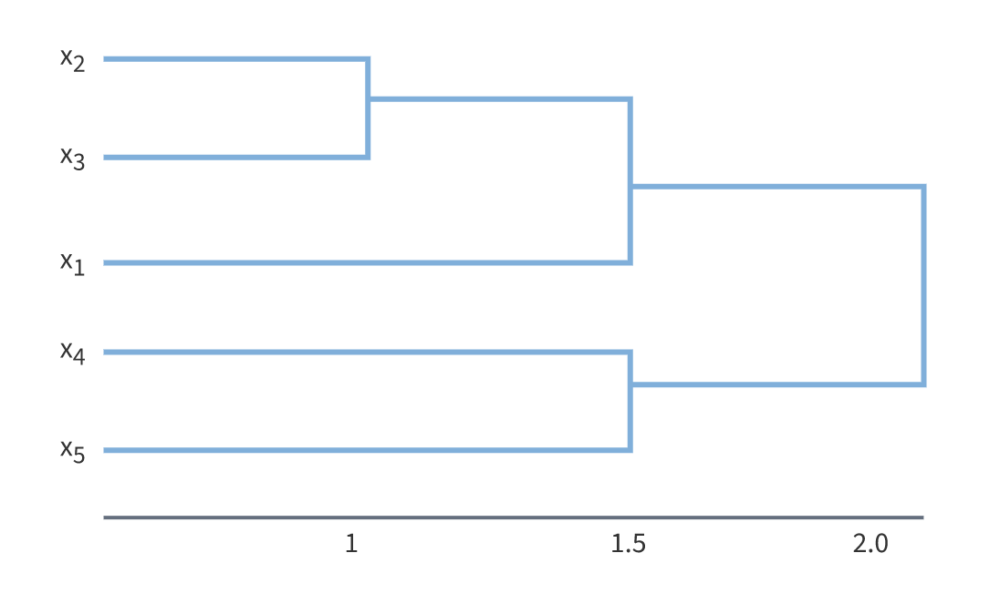

# Пояснения к дендограмме

В нижней части рисунка расположена шкала, на которой откладывается расстояние между объектами в пространстве признаков

# В завершение
* Документация: https://jokergoo.github.io/ComplexHeatmap-reference/book/index.html
* Важно отметить, что переход от R pheatmap требует от вас минимума действий

---
Подготовил Саськов Л. К. 5030102/90401